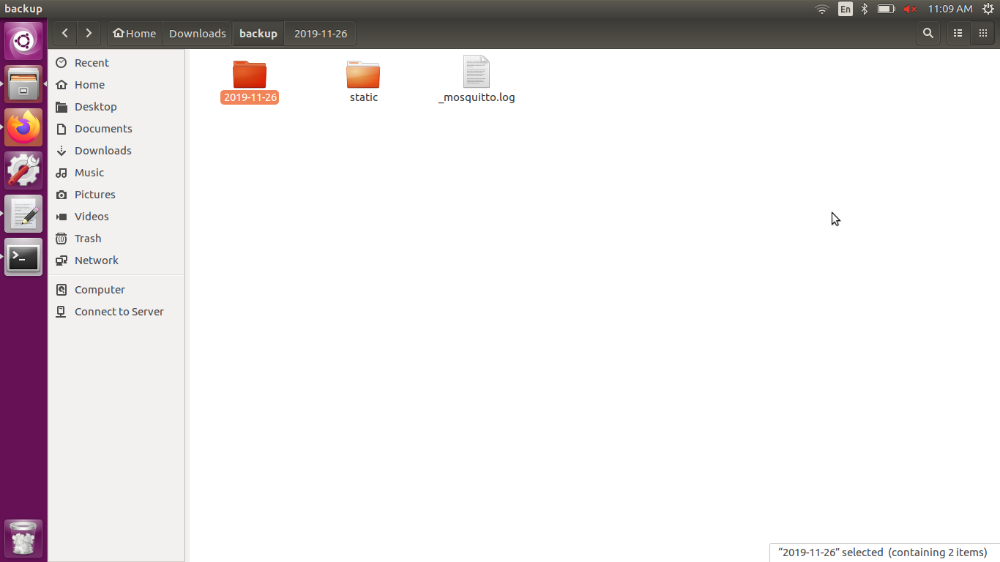

**Back-up and Restore of I3 instance**
======================================

* Back-up Script
* Restore Scipt

The Back-up script lets you store a copy of your I3 database locally on a periodic bases. The Restore script lets you recreate an instance or recover your previous state of the I3 instance.

**Back-up Folder**
++++++++++++++++++

The script creates a directory which consists of two folders and a Mosquitto log. First folder to consist of all the dynamic data that is updated on a daily basis. Second folder to consist of the static files. Third the Mosquitto log that keeps track of the MQTT system status from the initialization of I3 instance.  

The first folder is named in YYYY-MM-DD format using the 

Run:

.. code-block:: bash

   $ date +%Y-%m-%d

command in shell scripting. This done to differentiate the folders based on the back up dates. The output will be a timely log of the instance.

.. image::backup3.png
 
The Django and MySQL files are named with the date when the script is run. Django dump saved as a .json file and the  MySQL dump saved as a .sql file. The script pulls the dumps from their respctive Docker containers using their respective conatiner IDs. This folder basically contains the data needed for the back end to start off.

.. image::backup4.png

The static files consist of the product images that are displayed on the HTML page. This folder contains the front end data segreagated as media and protected folders.

Third the Mosquitto log is saved using the epoch time with the corresponding system status in a two column format.

**Back-up Script**
+++++++++++++++++++++++++++++++

The Back-up script is a Bash file named **backup.sh** found in the scripts folder of IOTM along with the setup.sh and i3_start.sh scripts.There are two place holder variables in the script that can be changed to preference. One is the path and other is days of rotation.

**Updating the Parameters**
The backup path has to be changed according to your preference in the script. In the example format **"/home/ubuntu/backup/"**. Note to put a "/" at the end of the path so that the files are copied inside the directory. The trailing slash "/" makes sure that the path is a directory and not a file. Update the path in the BACKUP_LOCATION variable shown in the image below.

The rotational backup of the directories and the mosquitto log is done by default for 31 days. Change the **DAYS** variable to update the preferred number of days of rotation as shown in the image above. 

**Running the Back-up Script**
Make the Bash file of the Back-up script executable by running the
Run:

.. code-block:: bash

   $ sudo chmod +x backup.sh

Alternatively you can also, Right click on your script and chose **Properties -> Permissions -> Allow executing file as program**, leaves you with the exact same result as the command in terminal.

Then, the script can be run using 
Run:

.. code-block:: bash 

   $ sudo ./backup.sh

In some cases sudo is needed as the Docker deamon binds to the Unix socket instead of a TCP port. By default that Unix socket is owned by the user root by default,and so, you can access it with sudo.

To automate the process, and keep a regular backup: Make use of the **crontab**, more information can be found at: < https://opensource.com/article/17/11/how-use-cron-linux >
Example:
Run:

.. code-block:: bash

   $ crontab -e

Update the time as needed. MIN HOUR DOM MON DOW COMMAND

Finally, check for the output as shown in the image. Also, make sure that your Back-up Folder has the mentioned folders and the Mosquittofinal.log is up to date.

**Restore**
++++++++++++

To restore, we need the latest **MySQL dump** and the **static folder** of the instance that we are trying to recreate. 
The Restore script copies the MySQL table in to the MySQL Docker container to restore the Usernames and 

**Running the Restore Script**
Make the Bash file of the Restore script executable by running the
Run:

.. code-block:: bash

   $ sudo chmod +x restore.sh

Alternatively you can also, Right click on your script and chose **Properties -> Permissions -> Allow executing file as program**, leaves you with the exact same result as the command in terminal.

Then, the script can be run using 
Run:

.. code-block:: bash

   $ sudo ./restore.sh

When prompted on the terminal, enter the path to the Back-up folder containing the latest MySQL dump and static files. When entering the path make sure it is of the format: "/home/ubuntu/backup/" including the trailing slash "/" at the end of the path to make sure it is a directory.

When promted again for the MySQl dump, enter the path to the latest MySQL .sql file. Alternatively you can enter the path to the prefferred MySQL path. The path to be entered will ideally be of the form: '/home/ubuntu/backup/2019-11-05/2019-11-05_mysql.sql'

