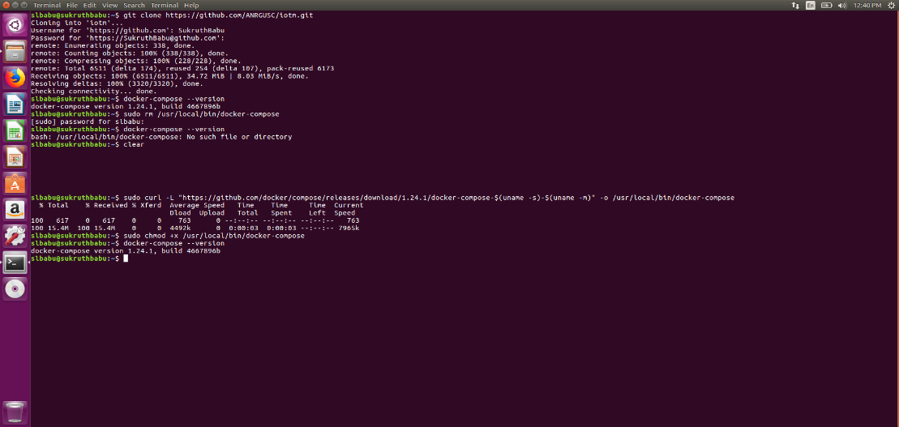
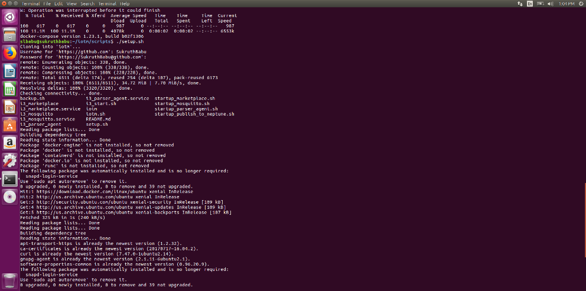
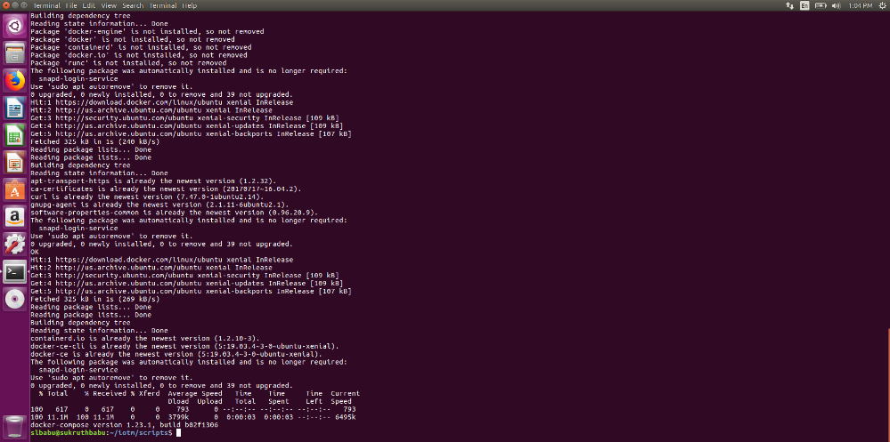
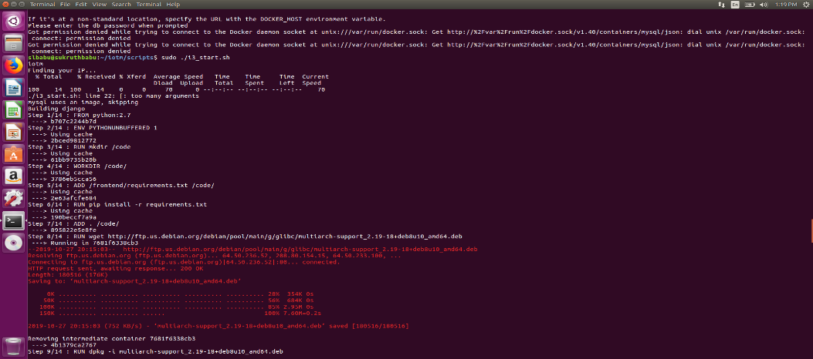
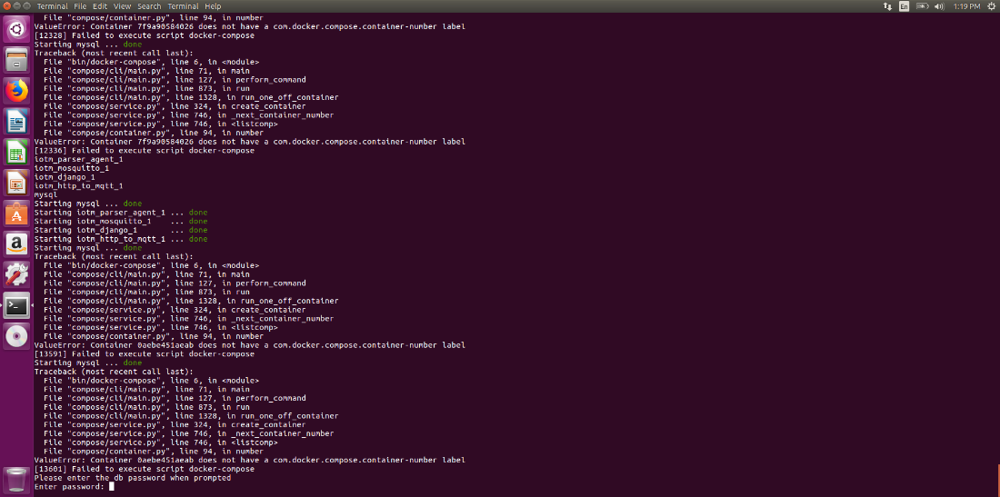
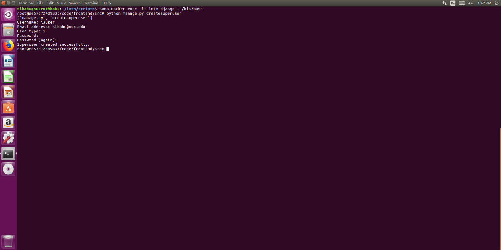
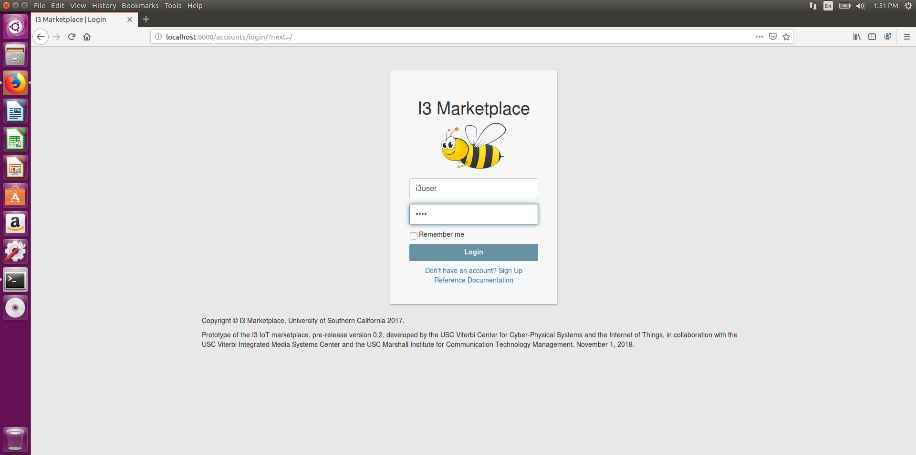
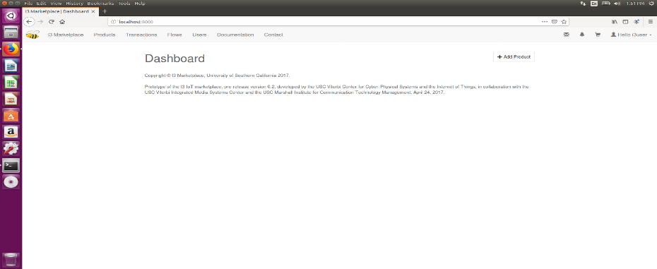

**SETTING UP LOCAL INSTANCE OF I3**
###################################

**Requirements**
================

* Ubuntu 16.04 or 18.04
* Minimum of 30gb space

.. image:: pic1.jpg

The I3 marketplace is implemented with a web-based marketplace frontend connected to a publish-subscribe broker backend. The website allows sellers to post streaming data products, buyers to purchase them, and then the broker allows the corresponding data river to flow from the authorized seller to the buyer.

**Front-End**
+++++++++++++

The frontend of I3 is a marketplace built using 'Apache <https://en.wikipedia.org/wiki/Apache_HTTP_Server>'_, 'a free and open-source cross-platform web server <https://en.wikipedia.org/wiki/Free_and_open-source_software>'_software. I3 is also built upon the open source code by 'Digital Marketplace <https://github.com/codingforentrepreneurs/digital-marketplace>'_, which provided much of the structure and functionality for buying and selling digital products. Digital Marketplace is an implementation of Django. We have transitioned from Django version to Apache version. 

**Back-End**
++++++++++++

The backend uses 'eclipse mosquitto <https://mosquitto.org/>'_, an implementation of 'MQTT <http://mqtt.org/>'_ protocol, as the platform to broker messages between publishers and subscribers.

**Clients**
+++++++++++

Sample publisher and subscriber codes.

**Gateways/Backnets**
+++++++++++++++++++++

This is a publisher client that gets data from University of Southern California's BACnet network. It can be used by any other BACnet network. Many automated buildings employ BACnet equipment.

**Scripts**
+++++++++++

Scripts to be run at boot up.
Run the i3_start.sh script in order to start the whole iotm project.

The .sh files are shell scripts that can be executed to start the processes (you can call it in /etc/rc.local). This is not a safe method, since it does not restart the processes after a crash, just starts them once.
The .service files are systemd files that can to use to start Ubuntu services during bootup time. These files have to be copied (or linked) to /etc/systemd/system. The systemd was introduced in Ubuntu 16.04, so old versions have to use upstart system To enable the services: $ systemctl enable <service_name> $ systemctl start <service_name>
The files without extension are scripts to be used by System V. They have to be used on Ubuntu 14.04 or older. To enable the services: $ service <service_name> enable

There are three main services or scripts that need to be started:

* i3_marketplace
* i3_mosquitto
* i3_parser_agent

**I3 installation on Ubuntu 16.04 or 18.03**
============================================

**Step 1: Cloning the repository**
++++++++++++++++++++++++++++++++++

Open a terminal on Ubuntu using Ctrl + Alt + T or using the search bar. Clone the repository onto your system using the following command git clone **https://github.com/ANRGUSC/iotm.git**.

You will be asked for the login credentials for your user account such as Username and Password for your github account. Enter the credentials accordingly. The cloning of the repository will be completed within a minute or two.

**Step 2: Downloading docker and docker compose onto your system.**
+++++++++++++++++++++++++++++++++++++++++++++++++++++++++++++++++++

The whole project can be run using docker. If you do not have docker installed please visit https://docs.docker.com/install/ and follow instructions for installions for your respective machine. Download docker from this link https://docs.docker.com/install/linux/docker-ce/ubuntu/

The whole project can be run using docker. If you do not have docker installed please visit https://docs.docker.com/install/ and follow instructions for installions for your respective machine.

You should install docker compose. Visit https://docs.docker.com/compose/install/ and install docker compose on your system. Install docker compose on your ubuntu using curl.

::

   After installation of docker compose is complete, please verify the installation using the following command 
   docker-compose –version
   docker-compose version 1.24.1, build 1110ad01

Here is the screenshot of the installation completion : 

**Step3 : Setting up i3 on your machine**
+++++++++++++++++++++++++++++++++++++++++

Change the directory using the cd command and go to iotm directory and then to the scripts directory on your terminal
cd iotm
cd scripts

Run the script using ./<fileName> from your terminal.

* Run **./setup.sh** script first.

You may encounter the following error :
**bash: ./setup.sh: Permission denied**

**Solution**:
Change the permission for this script. Run sudo chmod 777 setup.sh. You will be asked for your password. Please enter the password. The file permissions will be modified. Please visit https://www.maketecheasier.com/file-permissions-what-does-chmod-777-means/ for further understanding about changing file permissions.

Then again run ./setup.sh on your terminal. You will be asked to enter your github username and password. Go ahead and enter them. The setting up of I3 instance on your system will begin.

Please look at the setup.sh file in order to see the actual commands being run.

* Run **i3_start.sh** script

Run the i3_start.sh script that is placed under scripts. This starts the **frontend, backend, parser agent, http to mqtt converter, and mysql server**. The script also makes a few changes to the started containers in order for the marketplace to successfully run. Please look at the i3_start.sh file in order to see the actual commands being run.
Run the following command **sudo ./i3_start.sh** . If you just run ./i3_start.sh, you will encounter a permission denied error. **Please look at the end of document for troubleshooting steps**.

You will be prompted to enter the database password. 

The password is **AnRg@UsC**. Go ahead and enter the password.

**Step4 : Creating a super user to Log-in to I3 website**
+++++++++++++++++++++++++++++++++++++++++++++++++++++++++

Now that you have I3 up and running, there is no default user and password. A super user must be created through the Django container.

1. Enter the Django container shell:

::
  $ sudo docker exec -it iotm_django_1 /bin/bash

2. Run this python script:

::
  python manage.py createsuperuser

3. Fill in the user details, and type exit on the terminal once the super user is created.
4. Try Logging in with the super user credentials you just created.

**Step5 : MQTT ACL table creation**
+++++++++++++++++++++++++++++++++++

1. Enter the mysql container shell:

::

  $ docker exec -it mysql bash

2. Navigate to /var/log/mosquitto and change the permissions of mosquitto.log file.

::

  $ cd /var/log/mosquitto
  $ chmod 755 mosquitto.log

3. Then, run this mysql command:

::

  $ mysql -u anrg_iotm -pAnRg@UsC

4. Load the example user and acl tables in the database (database: iotm2):

::

  mysql> use iotm2;
  mysql> source mysql.sql;
  mysql> exit

**Step6 : Access I3 Marketplace website**
+++++++++++++++++++++++++++++++++++++++++

1. Open a web browser and type his url: localhost:8000
2. Log-in with the super user credentials.
3. After logging in, you should see the Dashboard page.

**MySQL Troubleshooting**
=========================

**Case 1**:
+++++++++++

Upon build, if django.db.utils.OperationalError: (1130, "Host '(Your IP Address)' is not allowed to connect to this MySQL server") is thrown, please follow the steps below:

Remove the existing mysql contiainer by running these commands:

::

  $ docker kill mysql
  $ docker rm -f mysql

**Case 2**:
+++++++++++

::
 
  Starting mysql ... error

  ERROR: for mysql  Cannot start service mysql: b'driver failed programming external connectivity on endpoint mysql (47c15280369b9e78c6a291047dcf77a9e24711447d4704a8c626c066cd9fb31f): Error starting userland proxy: listen tcp 0.0.0.0:(some port number): bind: address already in use'

  ERROR: for mysql  Cannot start service mysql: b'driver failed programming external connectivity on endpoint mysql (47c15280369b9e78c6a291047dcf77a9e24711447d4704a8c626c066cd9fb31f): Error starting   userland proxy: listen tcp 0.0.0.0:(some port number): bind: address already in use'
  ERROR: Encountered errors while bringing up the project.
  ERROR: No container found for django_1
  Starting mysql ... error
  ....
 

This means that some application is already listen on the port specified. This could be due to previous i3 starts. To know which application is listening, run this command: sudo netstat -plnt | grep ':(port number)'

In the last column, it should say the name of the application running. Simply stop it with this command: sudo systemctl stop PROGRAM_NAME

**Case 3**:
+++++++++++

(MAC) Upon build, if this is error comes up: Starting 7b18c081fda8_mysql ... error ERROR: for 7b18c081fda8_mysql Cannot start service mysql: b'driver failed programming external connectivity on endpoint 7b18c081fda8_mysql (0a6be91417b839ae095bd28bcf2e85c521f5fbe976bae0c2260448487f4eda3b): Error starting userland proxy: Bind for 0.0.0.0:3306 failed: port is already allocated'

This means that MySQL is already running in the specified port in the error message. Need to kill the MySQL instance at that port.

Run :

::

  sudo lsof -i :(PORT NUMBER)
  $ sudo kill -9 (PORT NUMBER) or sudo kill $(lsof -t -i :PORT NUMBER)

**Features**
============

1. Supports TLS 1.2 on port 8883
2. Supports TLS 1.1 on port 9001
3. Supports Web Socket on port 9010
4. Scripts to backup I3 instance and restore
5. Scripts to setup I3 on both ubuntu and debian instance
6. Automated installation of I3 instance

**License**
===========

MIT

